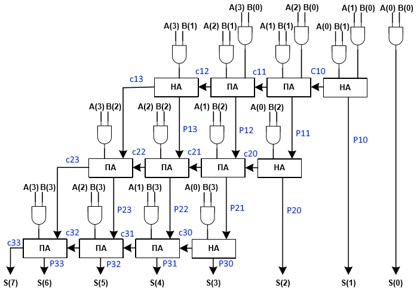
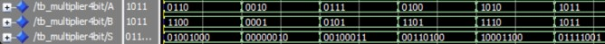
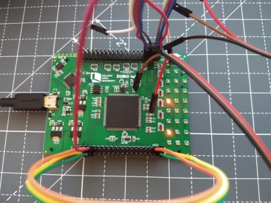

# Multiplier4bit

A 4bit Multiplier in VHDL 

## Information

This is a VHDL project for DSD-I1* a Cyclone IV FPGA built in Quartus 18.1 to build a 2 x 4bit number multiplier using Full Adders and Half Adders and is based in the example of the book 

**Diagram**:  

**Behavioral VHDL code**: Multiplier4bit.vhd  
**Testbench VHDL code**: Multiplier4bit_tb.vhd  

**ModelSim**:  

**FPGA**:  

*Note: DSD-i1: A Mixed Functionality Development Board Geared Towards Digital Systems Design Education [DOI:10.1109/DSD.2019.00032](https://www.researchgate.net/deref/http%3A%2F%2Fdx.doi.org%2F10.1109%2FDSD.2019.00032?_sg%5B0%5D=v-cnN-1Q246lx6ZElyyd_L2GLjVH2cDblXKnupqF6zBTWGsRmigTw_ho2UEIExompd-pfg1aXKe2HxtKhm8yTj_qKA.RFCrYuolSv1xRRtksL0NU8xa-sfrV6ZTsQm8Z6Ge2xh6ypvMKM0sHAtBECzdcRJoFOjJpYWyh5DrIrnMCZrsYA)

## Licence

Copyright (c) 2019 Stavros Kalapothas (aka Stevaras) <stavros@ubinet.gr>.
It is free software, and may be redistributed under the terms of the GNU Licence.